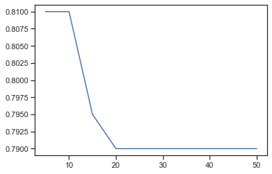
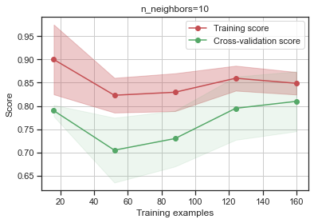
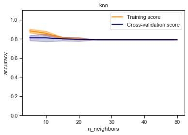

```python
from IPython.display import Image
import numpy as np
import pandas as pd
from sklearn.model_selection import train_test_split
from sklearn.datasets import load_iris, load_boston
from sklearn.neighbors import KNeighborsRegressor, KNeighborsClassifier
from sklearn.model_selection import cross_val_score, cross_validate
from sklearn.model_selection import KFold, RepeatedKFold, LeaveOneOut, LeavePOut, ShuffleSplit, StratifiedKFold
from sklearn.metrics import accuracy_score, balanced_accuracy_score
from sklearn.metrics import precision_score, recall_score, f1_score, classification_report
from sklearn.metrics import confusion_matrix
from sklearn.metrics import mean_absolute_error, mean_squared_error, mean_squared_log_error, median_absolute_error, r2_score 
from sklearn.metrics import roc_curve, roc_auc_score
from sklearn.model_selection import GridSearchCV, RandomizedSearchCV
from sklearn.model_selection import learning_curve, validation_curve
import seaborn as sns
import matplotlib.pyplot as plt
%matplotlib inline 
sns.set(style="ticks")
```


```python
data = pd.read_csv("data/Admission_Predict_Ver1.1.csv")
data
```


<div>
<style scoped>
    .dataframe tbody tr th:only-of-type {
        vertical-align: middle;
    }

    .dataframe tbody tr th {
        vertical-align: top;
    }

    .dataframe thead th {
        text-align: right;
    }
</style>
<table border="1" class="dataframe">
  <thead>
    <tr style="text-align: right;">
      <th></th>
      <th>Serial No.</th>
      <th>GRE Score</th>
      <th>TOEFL Score</th>
      <th>University Rating</th>
      <th>SOP</th>
      <th>LOR</th>
      <th>CGPA</th>
      <th>Research</th>
      <th>Chance of Admit</th>
    </tr>
  </thead>
  <tbody>
    <tr>
      <th>0</th>
      <td>1</td>
      <td>337</td>
      <td>118</td>
      <td>4</td>
      <td>4.5</td>
      <td>4.5</td>
      <td>9.65</td>
      <td>1</td>
      <td>0.92</td>
    </tr>
    <tr>
      <th>1</th>
      <td>2</td>
      <td>324</td>
      <td>107</td>
      <td>4</td>
      <td>4.0</td>
      <td>4.5</td>
      <td>8.87</td>
      <td>1</td>
      <td>0.76</td>
    </tr>
    <tr>
      <th>2</th>
      <td>3</td>
      <td>316</td>
      <td>104</td>
      <td>3</td>
      <td>3.0</td>
      <td>3.5</td>
      <td>8.00</td>
      <td>1</td>
      <td>0.72</td>
    </tr>
    <tr>
      <th>3</th>
      <td>4</td>
      <td>322</td>
      <td>110</td>
      <td>3</td>
      <td>3.5</td>
      <td>2.5</td>
      <td>8.67</td>
      <td>1</td>
      <td>0.80</td>
    </tr>
    <tr>
      <th>4</th>
      <td>5</td>
      <td>314</td>
      <td>103</td>
      <td>2</td>
      <td>2.0</td>
      <td>3.0</td>
      <td>8.21</td>
      <td>0</td>
      <td>0.65</td>
    </tr>
    <tr>
      <th>...</th>
      <td>...</td>
      <td>...</td>
      <td>...</td>
      <td>...</td>
      <td>...</td>
      <td>...</td>
      <td>...</td>
      <td>...</td>
      <td>...</td>
    </tr>
    <tr>
      <th>495</th>
      <td>496</td>
      <td>332</td>
      <td>108</td>
      <td>5</td>
      <td>4.5</td>
      <td>4.0</td>
      <td>9.02</td>
      <td>1</td>
      <td>0.87</td>
    </tr>
    <tr>
      <th>496</th>
      <td>497</td>
      <td>337</td>
      <td>117</td>
      <td>5</td>
      <td>5.0</td>
      <td>5.0</td>
      <td>9.87</td>
      <td>1</td>
      <td>0.96</td>
    </tr>
    <tr>
      <th>497</th>
      <td>498</td>
      <td>330</td>
      <td>120</td>
      <td>5</td>
      <td>4.5</td>
      <td>5.0</td>
      <td>9.56</td>
      <td>1</td>
      <td>0.93</td>
    </tr>
    <tr>
      <th>498</th>
      <td>499</td>
      <td>312</td>
      <td>103</td>
      <td>4</td>
      <td>4.0</td>
      <td>5.0</td>
      <td>8.43</td>
      <td>0</td>
      <td>0.73</td>
    </tr>
    <tr>
      <th>499</th>
      <td>500</td>
      <td>327</td>
      <td>113</td>
      <td>4</td>
      <td>4.5</td>
      <td>4.5</td>
      <td>9.04</td>
      <td>0</td>
      <td>0.84</td>
    </tr>
  </tbody>
</table>
<p>500 rows × 9 columns</p>
</div>


```python
data.info()
```

    <class 'pandas.core.frame.DataFrame'>
    RangeIndex: 500 entries, 0 to 499
    Data columns (total 9 columns):
     #   Column             Non-Null Count  Dtype  
    ---  ------             --------------  -----  
     0   Serial No.         500 non-null    int64  
     1   GRE Score          500 non-null    int64  
     2   TOEFL Score        500 non-null    int64  
     3   University Rating  500 non-null    int64  
     4   SOP                500 non-null    float64
     5   LOR                500 non-null    float64
     6   CGPA               500 non-null    float64
     7   Research           500 non-null    int64  
     8   Chance of Admit    500 non-null    float64
    dtypes: float64(4), int64(5)
    memory usage: 35.3 KB
    


```python
data.isnull().sum()
```


    Serial No.           0
    GRE Score            0
    TOEFL Score          0
    University Rating    0
    SOP                  0
    LOR                  0
    CGPA                 0
    Research             0
    Chance of Admit      0
    dtype: int64


```python
data.shape
```


    (500, 9)


```python
data.loc[data['Chance of Admit '] < 0.65, 'isAdmit'] = 0
data.loc[data['Chance of Admit '] >= 0.65, 'isAdmit'] = 1
data.isAdmit
```


    0      1.0
    1      1.0
    2      1.0
    3      1.0
    4      1.0
          ... 
    495    1.0
    496    1.0
    497    1.0
    498    1.0
    499    1.0
    Name: isAdmit, Length: 500, dtype: float64


```python
np.unique(data.isAdmit)
```


    array([0., 1.])


```python
target = data.iloc[:, -1]
new_data = data.iloc[:, :-2]

new_data.shape, target.shape
```


    ((500, 8), (500,))


```python
data_X_train, data_X_test, data_y_train, data_y_test = train_test_split(
    new_data, target, test_size=0.6, random_state=1
)
```


```python
data_X_train.shape, data_X_test.shape, data_y_train.shape, data_y_test.shape
```


    ((200, 8), (300, 8), (200,), (300,))


```python
cl1_1 = KNeighborsClassifier(n_neighbors=50)
cl1_1.fit(data_X_train, data_y_train)
target1_0 = cl1_1.predict(data_X_train)
target1_1 = cl1_1.predict(data_X_test)
accuracy_score(data_y_train, target1_0), accuracy_score(data_y_test, target1_1)
```


    (0.79, 0.6533333333333333)


```python
cl1_2 = KNeighborsClassifier(n_neighbors=15)
cl1_2.fit(data_X_train, data_y_train)
target2_0 = cl1_2.predict(data_X_train)
target2_1 = cl1_2.predict(data_X_test)
accuracy_score(data_y_train, target2_0), accuracy_score(data_y_test, target2_1)
```


    (0.83, 0.6966666666666667)


```python
cl1_3 = KNeighborsClassifier(n_neighbors=3)
cl1_3.fit(data_X_train, data_y_train)
target3_0 = cl1_3.predict(data_X_train)
target3_1 = cl1_3.predict(data_X_test)
accuracy_score(data_y_train, target3_0), accuracy_score(data_y_test, target3_1)
```


    (0.925, 0.82)


```python
scores1 = cross_val_score(KNeighborsClassifier(n_neighbors=15), 
                         new_data, target, 
                         cv=5)
scores1, np.mean(scores1)
```


    (array([0.35, 0.52, 0.71, 0.6 , 0.77]), 0.5900000000000001)


```python
scores2 = cross_val_score(KNeighborsClassifier(n_neighbors=15), 
                         new_data, target, 
                         cv=5, scoring='jaccard')
scores2, np.mean(scores2)
```


    (array([0.08450704, 0.52      , 0.71      , 0.43661972, 0.69333333]),
     0.4888920187793427)


```python
scores3 = cross_val_score(KNeighborsClassifier(n_neighbors=15), 
                         new_data, target, 
                         cv=3, scoring='f1')
scores3, np.mean(scores3)
```


    (array([0.31428571, 0.83985765, 0.12698413]), 0.427042497505131)


```python
scoring = {
    'accuracy': 'accuracy',
    'jaccard': 'jaccard',
    'f1': 'f1'
}

scores = cross_validate(KNeighborsClassifier(n_neighbors=15), 
                        new_data, target, scoring=scoring, 
                        cv=5, return_train_score=True)
scores
```


    {'fit_time': array([0.00699782, 0.00499678, 0.00399804, 0.00399756, 0.00499845]),
     'score_time': array([0.01299381, 0.0109942 , 0.00799537, 0.00799584, 0.00799394]),
     'test_accuracy': array([0.35, 0.52, 0.71, 0.6 , 0.77]),
     'train_accuracy': array([0.865 , 0.8625, 0.8975, 0.855 , 0.8625]),
     'test_jaccard': array([0.08450704, 0.52      , 0.71      , 0.43661972, 0.69333333]),
     'train_jaccard': array([0.83685801, 0.83333333, 0.86900958, 0.82477341, 0.83333333]),
     'test_f1': array([0.15584416, 0.68421053, 0.83040936, 0.60784314, 0.81889764]),
     'train_f1': array([0.91118421, 0.90909091, 0.92991453, 0.90397351, 0.90909091])}


```python
%%time
scores = cross_val_score(KNeighborsClassifier(n_neighbors=15), 
                         new_data, target, 
                         cv=LeaveOneOut())
scores, np.mean(scores)
```

    Wall time: 3.89 s
    


    (array([1., 1., 1., 1., 0., 1., 1., 0., 1., 0., 0., 1., 1., 1., 1., 1., 1.,
            1., 0., 1., 1., 1., 1., 1., 1., 1., 1., 1., 1., 1., 0., 1., 1., 1.,
            1., 1., 1., 1., 1., 1., 1., 0., 1., 1., 1., 1., 1., 1., 1., 1., 0.,
            1., 1., 1., 0., 1., 1., 1., 1., 1., 1., 1., 1., 1., 0., 0., 0., 1.,
            0., 1., 1., 1., 1., 1., 1., 1., 1., 1., 1., 1., 0., 1., 1., 1., 1.,
            1., 1., 1., 0., 1., 0., 1., 1., 1., 1., 1., 1., 1., 1., 1., 1., 1.,
            0., 0., 1., 1., 1., 1., 1., 0., 1., 1., 1., 1., 1., 0., 1., 1., 1.,
            1., 1., 1., 0., 0., 1., 1., 1., 1., 1., 1., 1., 0., 1., 1., 1., 1.,
            1., 1., 1., 1., 1., 1., 1., 1., 1., 1., 1., 1., 1., 1., 1., 1., 1.,
            1., 1., 1., 1., 1., 0., 0., 0., 0., 1., 1., 1., 1., 1., 0., 0., 1.,
            1., 1., 1., 1., 1., 1., 1., 1., 1., 1., 1., 1., 1., 1., 1., 1., 1.,
            1., 1., 1., 1., 1., 1., 1., 1., 1., 1., 1., 1., 1., 1., 1., 1., 1.,
            1., 0., 0., 1., 0., 1., 1., 1., 1., 1., 1., 1., 1., 1., 1., 1., 1.,
            1., 1., 1., 1., 0., 0., 0., 1., 1., 1., 1., 1., 0., 1., 1., 1., 1.,
            1., 0., 0., 1., 1., 1., 0., 1., 1., 1., 1., 1., 1., 1., 1., 1., 1.,
            1., 1., 1., 1., 1., 1., 1., 1., 1., 1., 1., 1., 1., 1., 1., 1., 0.,
            0., 0., 0., 1., 1., 1., 1., 1., 1., 1., 1., 1., 1., 1., 1., 1., 1.,
            1., 0., 0., 0., 0., 0., 1., 1., 1., 1., 1., 0., 1., 1., 1., 0., 1.,
            1., 1., 1., 1., 1., 1., 1., 1., 1., 1., 0., 0., 1., 1., 1., 1., 1.,
            0., 1., 1., 0., 0., 1., 1., 1., 1., 1., 1., 1., 1., 1., 1., 1., 1.,
            1., 1., 0., 1., 1., 0., 1., 1., 1., 0., 1., 1., 1., 1., 1., 1., 1.,
            0., 1., 1., 1., 1., 1., 0., 1., 1., 1., 0., 1., 0., 1., 1., 1., 1.,
            0., 1., 1., 1., 1., 0., 1., 1., 1., 1., 1., 1., 1., 1., 1., 1., 0.,
            1., 1., 1., 1., 1., 1., 1., 0., 1., 1., 0., 1., 1., 1., 1., 0., 1.,
            1., 1., 1., 1., 1., 0., 1., 1., 0., 0., 0., 1., 1., 1., 1., 1., 1.,
            1., 1., 0., 1., 1., 0., 1., 1., 1., 0., 0., 0., 0., 1., 1., 0., 1.,
            1., 1., 1., 1., 1., 1., 1., 1., 1., 1., 1., 1., 1., 0., 1., 1., 1.,
            1., 1., 0., 0., 1., 1., 1., 1., 1., 1., 1., 1., 0., 1., 1., 1., 0.,
            0., 1., 1., 1., 1., 1., 1., 1., 1., 1., 1., 1., 1., 1., 1., 0., 0.,
            0., 1., 1., 1., 1., 1., 1.]),
     0.824)


```python
kf = KFold(n_splits=5)
scores = cross_val_score(KNeighborsClassifier(n_neighbors=10), 
                         new_data, target, 
                         cv=kf)
scores
```


    array([0.76, 0.77, 0.81, 0.62, 0.74])


```python
n_range = np.array(range(5,55,5))
tuned_parameters = [{'n_neighbors': n_range}]
tuned_parameters
```


    [{'n_neighbors': array([ 5, 10, 15, 20, 25, 30, 35, 40, 45, 50])}]


```python
%%time
clf_gs = GridSearchCV(KNeighborsClassifier(), tuned_parameters, cv=5, scoring='accuracy')
clf_gs.fit(data_X_train, data_y_train)
```

    Wall time: 503 ms
    


    GridSearchCV(cv=5, estimator=KNeighborsClassifier(),
                 param_grid=[{'n_neighbors': array([ 5, 10, 15, 20, 25, 30, 35, 40, 45, 50])}],
                 scoring='accuracy')


```python
clf_gs.cv_results_
```


    {'mean_fit_time': array([0.00539775, 0.00439777, 0.00360117, 0.00439715, 0.00319815,
            0.00319843, 0.00399475, 0.00579686, 0.00499306, 0.00459676]),
     'std_fit_time': array([0.00048992, 0.00101884, 0.00048532, 0.00135525, 0.00039971,
            0.00040043, 0.00062511, 0.0020421 , 0.00063718, 0.00079986]),
     'mean_score_time': array([0.00659523, 0.00419726, 0.00499401, 0.00479727, 0.0043973 ,
            0.00400066, 0.00439377, 0.00579667, 0.00620103, 0.0057972 ]),
     'std_score_time': array([1.01912224e-03, 4.00114443e-04, 6.31988295e-04, 1.16610586e-03,
            4.89375878e-04, 7.27704123e-06, 5.00204961e-04, 9.79326166e-04,
            7.52164723e-04, 1.16565645e-03]),
     'param_n_neighbors': masked_array(data=[5, 10, 15, 20, 25, 30, 35, 40, 45, 50],
                  mask=[False, False, False, False, False, False, False, False,
                        False, False],
            fill_value='?',
                 dtype=object),
     'params': [{'n_neighbors': 5},
      {'n_neighbors': 10},
      {'n_neighbors': 15},
      {'n_neighbors': 20},
      {'n_neighbors': 25},
      {'n_neighbors': 30},
      {'n_neighbors': 35},
      {'n_neighbors': 40},
      {'n_neighbors': 45},
      {'n_neighbors': 50}],
     'split0_test_score': array([0.8  , 0.825, 0.825, 0.8  , 0.8  , 0.8  , 0.8  , 0.8  , 0.8  ,
            0.8  ]),
     'split1_test_score': array([0.875, 0.9  , 0.825, 0.8  , 0.8  , 0.8  , 0.8  , 0.8  , 0.8  ,
            0.8  ]),
     'split2_test_score': array([0.875, 0.85 , 0.8  , 0.825, 0.8  , 0.8  , 0.8  , 0.8  , 0.8  ,
            0.8  ]),
     'split3_test_score': array([0.725, 0.725, 0.75 , 0.775, 0.775, 0.775, 0.775, 0.775, 0.775,
            0.775]),
     'split4_test_score': array([0.775, 0.75 , 0.775, 0.75 , 0.775, 0.775, 0.775, 0.775, 0.775,
            0.775]),
     'mean_test_score': array([0.81 , 0.81 , 0.795, 0.79 , 0.79 , 0.79 , 0.79 , 0.79 , 0.79 ,
            0.79 ]),
     'std_test_score': array([0.05830952, 0.06442049, 0.02915476, 0.0254951 , 0.01224745,
            0.01224745, 0.01224745, 0.01224745, 0.01224745, 0.01224745]),
     'rank_test_score': array([ 2,  1,  3, 10,  4,  4,  4,  4,  4,  4])}


```python
clf_gs.best_estimator_
```


    KNeighborsClassifier(n_neighbors=10)


```python
clf_gs.best_score_
```


    0.8100000000000002


```python
clf_gs.best_params_
```


    {'n_neighbors': 10}


```python
plt.plot(n_range, clf_gs.cv_results_['mean_test_score'])
```


    [<matplotlib.lines.Line2D at 0x29560f902b0>]





```python
def plot_learning_curve(estimator, title, X, y, ylim=None, cv=None,
                        n_jobs=None, train_sizes=np.linspace(.1, 1.0, 5)):
    plt.figure()
    plt.title(title)
    if ylim is not None:
        plt.ylim(*ylim)
    plt.xlabel("Training examples")
    plt.ylabel("Score")
    train_sizes, train_scores, test_scores = learning_curve(
        estimator, X, y, cv=cv, n_jobs=n_jobs, train_sizes=train_sizes)
    train_scores_mean = np.mean(train_scores, axis=1)
    train_scores_std = np.std(train_scores, axis=1)
    test_scores_mean = np.mean(test_scores, axis=1)
    test_scores_std = np.std(test_scores, axis=1)
    plt.grid()

    plt.fill_between(train_sizes, train_scores_mean - train_scores_std,
                     train_scores_mean + train_scores_std, alpha=0.3,
                     color="r")
    plt.fill_between(train_sizes, test_scores_mean - test_scores_std,
                     test_scores_mean + test_scores_std, alpha=0.1, color="g")
    plt.plot(train_sizes, train_scores_mean, 'o-', color="r",
             label="Training score")
    plt.plot(train_sizes, test_scores_mean, 'o-', color="g",
             label="Cross-validation score")

    plt.legend(loc="best")
    return plt
```


```python
plot_learning_curve(KNeighborsClassifier(n_neighbors=10), 'n_neighbors=10', 
                    data_X_train, data_y_train, cv=5)
```


    <module 'matplotlib.pyplot' from 'c:\\users\\ncher\\appdata\\local\\programs\\python\\python36\\lib\\site-packages\\matplotlib\\pyplot.py'>





```python
def plot_validation_curve(estimator, title, X, y, 
                          param_name, param_range, cv, 
                          scoring="accuracy"):
                                                   
    train_scores, test_scores = validation_curve(
        estimator, X, y, param_name=param_name, param_range=param_range,
        cv=cv, scoring=scoring, n_jobs=1)
    train_scores_mean = np.mean(train_scores, axis=1)
    train_scores_std = np.std(train_scores, axis=1)
    test_scores_mean = np.mean(test_scores, axis=1)
    test_scores_std = np.std(test_scores, axis=1)

    plt.title(title)
    plt.xlabel(param_name)
    plt.ylabel(str(scoring))
    plt.ylim(0.0, 1.1)
    lw = 2
    plt.plot(param_range, train_scores_mean, label="Training score",
                 color="darkorange", lw=lw)
    plt.fill_between(param_range, train_scores_mean - train_scores_std,
                     train_scores_mean + train_scores_std, alpha=0.4,
                     color="darkorange", lw=lw)
    plt.plot(param_range, test_scores_mean, label="Cross-validation score",
                 color="navy", lw=lw)
    plt.fill_between(param_range, test_scores_mean - test_scores_std,
                     test_scores_mean + test_scores_std, alpha=0.2,
                     color="navy", lw=lw)
    plt.legend(loc="best")
    return plt
```


```python
plot_validation_curve(KNeighborsClassifier(), 'knn', 
                      data_X_train, data_y_train, 
                      param_name='n_neighbors', param_range=n_range, 
                      cv=3, scoring="accuracy")
```


    <module 'matplotlib.pyplot' from 'c:\\users\\ncher\\appdata\\local\\programs\\python\\python36\\lib\\site-packages\\matplotlib\\pyplot.py'>





```python

```
