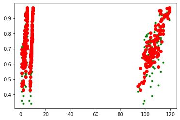
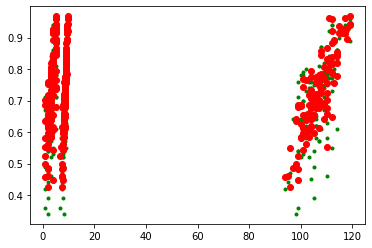

 

## Задание:
* Выберите набор данных (датасет) для решения задачи классификации или регресии.
* В случае необходимости проведите удаление или заполнение пропусков и кодирование категориальных признаков.
* С использованием метода train_test_split разделите выборку на обучающую и тестовую.
* Обучите две ансамблевые модели. Оцените качество моделей с помощью одной из подходящих для задачи метрик. Сравните качество полученных моделей.
* Произведите для каждой модели подбор значений одного гиперпараметра. В зависимости от используемой библиотеки можно применять * функцию GridSearchCV, использовать перебор параметров в цикле, или использовать другие методы.
* Повторите пункт 4 для найденных оптимальных значений гиперпараметров. Сравните качество полученных моделей с качеством моделей, полученных в пункте 4.


```python
import numpy as np
import pandas as pd
import matplotlib.pyplot as plt
from sklearn.model_selection import train_test_split
from sklearn.ensemble import RandomForestRegressor, GradientBoostingRegressor
from sklearn.metrics import mean_absolute_error,accuracy_score, r2_score 
```


```python
data = pd.read_csv("data/Admission_Predict_Ver1.1.csv")
```


```python
data.head()
```


<div>
<style scoped>
    .dataframe tbody tr th:only-of-type {
        vertical-align: middle;
    }

    .dataframe tbody tr th {
        vertical-align: top;
    }

    .dataframe thead th {
        text-align: right;
    }
</style>
<table border="1" class="dataframe">
  <thead>
    <tr style="text-align: right;">
      <th></th>
      <th>Serial No.</th>
      <th>GRE Score</th>
      <th>TOEFL Score</th>
      <th>University Rating</th>
      <th>SOP</th>
      <th>LOR</th>
      <th>CGPA</th>
      <th>Research</th>
      <th>Chance of Admit</th>
    </tr>
  </thead>
  <tbody>
    <tr>
      <th>0</th>
      <td>1</td>
      <td>337</td>
      <td>118</td>
      <td>4</td>
      <td>4.5</td>
      <td>4.5</td>
      <td>9.65</td>
      <td>1</td>
      <td>0.92</td>
    </tr>
    <tr>
      <th>1</th>
      <td>2</td>
      <td>324</td>
      <td>107</td>
      <td>4</td>
      <td>4.0</td>
      <td>4.5</td>
      <td>8.87</td>
      <td>1</td>
      <td>0.76</td>
    </tr>
    <tr>
      <th>2</th>
      <td>3</td>
      <td>316</td>
      <td>104</td>
      <td>3</td>
      <td>3.0</td>
      <td>3.5</td>
      <td>8.00</td>
      <td>1</td>
      <td>0.72</td>
    </tr>
    <tr>
      <th>3</th>
      <td>4</td>
      <td>322</td>
      <td>110</td>
      <td>3</td>
      <td>3.5</td>
      <td>2.5</td>
      <td>8.67</td>
      <td>1</td>
      <td>0.80</td>
    </tr>
    <tr>
      <th>4</th>
      <td>5</td>
      <td>314</td>
      <td>103</td>
      <td>2</td>
      <td>2.0</td>
      <td>3.0</td>
      <td>8.21</td>
      <td>0</td>
      <td>0.65</td>
    </tr>
  </tbody>
</table>
</div>


```python
data_X = data[["CGPA", "TOEFL Score", "University Rating"]]
```


```python
data_X
```


<div>
<style scoped>
    .dataframe tbody tr th:only-of-type {
        vertical-align: middle;
    }

    .dataframe tbody tr th {
        vertical-align: top;
    }

    .dataframe thead th {
        text-align: right;
    }
</style>
<table border="1" class="dataframe">
  <thead>
    <tr style="text-align: right;">
      <th></th>
      <th>CGPA</th>
      <th>TOEFL Score</th>
      <th>University Rating</th>
    </tr>
  </thead>
  <tbody>
    <tr>
      <th>0</th>
      <td>9.65</td>
      <td>118</td>
      <td>4</td>
    </tr>
    <tr>
      <th>1</th>
      <td>8.87</td>
      <td>107</td>
      <td>4</td>
    </tr>
    <tr>
      <th>2</th>
      <td>8.00</td>
      <td>104</td>
      <td>3</td>
    </tr>
    <tr>
      <th>3</th>
      <td>8.67</td>
      <td>110</td>
      <td>3</td>
    </tr>
    <tr>
      <th>4</th>
      <td>8.21</td>
      <td>103</td>
      <td>2</td>
    </tr>
    <tr>
      <th>...</th>
      <td>...</td>
      <td>...</td>
      <td>...</td>
    </tr>
    <tr>
      <th>495</th>
      <td>9.02</td>
      <td>108</td>
      <td>5</td>
    </tr>
    <tr>
      <th>496</th>
      <td>9.87</td>
      <td>117</td>
      <td>5</td>
    </tr>
    <tr>
      <th>497</th>
      <td>9.56</td>
      <td>120</td>
      <td>5</td>
    </tr>
    <tr>
      <th>498</th>
      <td>8.43</td>
      <td>103</td>
      <td>4</td>
    </tr>
    <tr>
      <th>499</th>
      <td>9.04</td>
      <td>113</td>
      <td>4</td>
    </tr>
  </tbody>
</table>
<p>500 rows × 3 columns</p>
</div>


```python
data_Y = data[["Chance of Admit "]]
```


```python
X_train, X_test, y_train, y_test = train_test_split(
    data_X, data_Y, test_size=0.25, random_state=1)
```


```python
# Качество отдельных моделей
def val_mae(model):
    model.fit(X_train, y_train)
    y_pred = model.predict(X_test)
    plt.plot(X_test, y_test, 'g.')
    plt.plot(X_test, y_pred, 'ro')
    plt.show()
    result = mean_absolute_error(y_test, y_pred)
    r2 = r2_score(y_test, y_pred)
    print(model)
    print('MAE={}'.format(result))
    print('R2={}'.format(r2))
```


```python
for model in [
    GradientBoostingRegressor(),
    RandomForestRegressor(n_estimators=50)
]:
    val_mae(model)
    print('==========================\n\n')
```

    c:\users\ncher\appdata\local\programs\python\python36\lib\site-packages\sklearn\utils\validation.py:73: DataConversionWarning: A column-vector y was passed when a 1d array was expected. Please change the shape of y to (n_samples, ), for example using ravel().
      return f(**kwargs)
    





    GradientBoostingRegressor()
    MAE=0.05018946886061301
    R2=0.7288949295990995
    ==========================
    
    
    

    c:\users\ncher\appdata\local\programs\python\python36\lib\site-packages\ipykernel_launcher.py:3: DataConversionWarning: A column-vector y was passed when a 1d array was expected. Please change the shape of y to (n_samples,), for example using ravel().
      This is separate from the ipykernel package so we can avoid doing imports until
    





    RandomForestRegressor(n_estimators=50)
    MAE=0.05431536000000001
    R2=0.6934410032452829
    ==========================
    
    
    

## Модель градиентного бустинга показала лучший результат на тестовой выборке


```python
from sklearn.model_selection import RandomizedSearchCV

n_estimators = [int(x) for x in np.linspace(start = 200, stop = 2000, num = 10)]

max_features = ['auto', 'sqrt']

max_depth = [int(x) for x in np.linspace(10, 110, num = 11)]
max_depth.append(None)

min_samples_split = [2, 5, 10]

min_samples_leaf = [1, 2, 4]

bootstrap = [True, False]

random_grid = {'n_estimators': n_estimators,
               'max_features': max_features,
               'max_depth': max_depth,
               'min_samples_split': min_samples_split,
               'min_samples_leaf': min_samples_leaf,
               'bootstrap': bootstrap}
random_grid
```


    {'n_estimators': [200, 400, 600, 800, 1000, 1200, 1400, 1600, 1800, 2000],
     'max_features': ['auto', 'sqrt'],
     'max_depth': [10, 20, 30, 40, 50, 60, 70, 80, 90, 100, 110, None],
     'min_samples_split': [2, 5, 10],
     'min_samples_leaf': [1, 2, 4],
     'bootstrap': [True, False]}


```python
rf = RandomForestRegressor()

rf_random = RandomizedSearchCV(estimator = rf, param_distributions = random_grid, n_iter = 100, cv = 3, verbose=2, random_state=42, n_jobs = -1)

rf_random.fit(X_train, y_train)
```

    Fitting 3 folds for each of 100 candidates, totalling 300 fits
    

    [Parallel(n_jobs=-1)]: Using backend LokyBackend with 4 concurrent workers.
    [Parallel(n_jobs=-1)]: Done  33 tasks      | elapsed:   35.9s
    [Parallel(n_jobs=-1)]: Done 154 tasks      | elapsed:  2.4min
    [Parallel(n_jobs=-1)]: Done 300 out of 300 | elapsed:  4.7min finished
    c:\users\ncher\appdata\local\programs\python\python36\lib\site-packages\sklearn\model_selection\_search.py:765: DataConversionWarning: A column-vector y was passed when a 1d array was expected. Please change the shape of y to (n_samples,), for example using ravel().
      self.best_estimator_.fit(X, y, **fit_params)
    


    RandomizedSearchCV(cv=3, estimator=RandomForestRegressor(), n_iter=100,
                       n_jobs=-1,
                       param_distributions={'bootstrap': [True, False],
                                            'max_depth': [10, 20, 30, 40, 50, 60,
                                                          70, 80, 90, 100, 110,
                                                          None],
                                            'max_features': ['auto', 'sqrt'],
                                            'min_samples_leaf': [1, 2, 4],
                                            'min_samples_split': [2, 5, 10],
                                            'n_estimators': [200, 400, 600, 800,
                                                             1000, 1200, 1400, 1600,
                                                             1800, 2000]},
                       random_state=42, verbose=2)


```python
rf_random.best_params_
```


    {'n_estimators': 1600,
     'min_samples_split': 2,
     'min_samples_leaf': 4,
     'max_features': 'sqrt',
     'max_depth': 10,
     'bootstrap': True}


```python
def evaluate(model, test_features, test_labels):
    predictions = model.predict(test_features)
    error = mean_absolute_error(y_test, predictions)
    r2 = r2_score(y_test, predictions)
    print('Model Performance')
    print('MAE: {:0.4f}'.format(error))
    print('R2 score: {:0.4f}'.format(r2))
    print('======================\n\n')

base_model = RandomForestRegressor(n_estimators = 10, random_state = 42)
base_model.fit(X_train, y_train)
evaluate(base_model, X_test, y_test)
```

    Model Performance
    MAE: 0.0534
    R2 score: 0.7026
    ======================
    
    
    

    c:\users\ncher\appdata\local\programs\python\python36\lib\site-packages\ipykernel_launcher.py:11: DataConversionWarning: A column-vector y was passed when a 1d array was expected. Please change the shape of y to (n_samples,), for example using ravel().
      # This is added back by InteractiveShellApp.init_path()
    


```python
best_random = rf_random.best_estimator_
evaluate(best_random, X_test, y_test)
```

    Model Performance
    MAE: 0.0509
    R2 score: 0.7375
    ======================
    
    
    

Видно, что подбор гиперпараметров улучшил нашу модель, уменьшив ошибку  на 0.0025


```python
n_estimators = [int(x) for x in np.linspace(start = 200, stop = 2000, num = 10)]

max_features = ['auto', 'sqrt']

max_depth = [int(x) for x in np.linspace(10, 110, num = 11)]
max_depth.append(None)

min_samples_split = [2, 5, 10]

min_samples_leaf = [1, 2, 4]

bootstrap = [True, False]

random_grid_Booster = {'n_estimators': n_estimators,
               'max_features': max_features,
               'max_depth': max_depth,
               'min_samples_split': min_samples_split,
               'min_samples_leaf': min_samples_leaf,
               }

```


```python
gb = GradientBoostingRegressor()

gb_random = RandomizedSearchCV(estimator = gb, param_distributions = random_grid_Booster, n_iter = 100, cv = 3, verbose=2, random_state=42, n_jobs = -1)

gb_random.fit(X_train, y_train)
```

    Fitting 3 folds for each of 100 candidates, totalling 300 fits
    

    [Parallel(n_jobs=-1)]: Using backend LokyBackend with 4 concurrent workers.
    [Parallel(n_jobs=-1)]: Done  33 tasks      | elapsed:   14.7s
    [Parallel(n_jobs=-1)]: Done 154 tasks      | elapsed:   55.5s
    [Parallel(n_jobs=-1)]: Done 300 out of 300 | elapsed:  1.8min finished
    c:\users\ncher\appdata\local\programs\python\python36\lib\site-packages\sklearn\utils\validation.py:73: DataConversionWarning: A column-vector y was passed when a 1d array was expected. Please change the shape of y to (n_samples, ), for example using ravel().
      return f(**kwargs)
    


    RandomizedSearchCV(cv=3, estimator=GradientBoostingRegressor(), n_iter=100,
                       n_jobs=-1,
                       param_distributions={'max_depth': [10, 20, 30, 40, 50, 60,
                                                          70, 80, 90, 100, 110,
                                                          None],
                                            'max_features': ['auto', 'sqrt'],
                                            'min_samples_leaf': [1, 2, 4],
                                            'min_samples_split': [2, 5, 10],
                                            'n_estimators': [200, 400, 600, 800,
                                                             1000, 1200, 1400, 1600,
                                                             1800, 2000]},
                       random_state=42, verbose=2)


```python
gb_random.best_params_
```


    {'n_estimators': 1400,
     'min_samples_split': 2,
     'min_samples_leaf': 1,
     'max_features': 'sqrt',
     'max_depth': 100}


```python
def evaluate(model, test_features, test_labels):
    predictions = model.predict(test_features)
    error = mean_absolute_error(y_test, predictions)
    r2 = r2_score(y_test, predictions)
    print('Model Performance')
    print('MAE: {:0.4f}'.format(error))
    print('R2 score: {:0.4f}'.format(r2))
    print('======================\n\n')

base_model = GradientBoostingRegressor()
base_model.fit(X_train, y_train)
evaluate(base_model, X_test, y_test)
```

    Model Performance
    MAE: 0.0505
    R2 score: 0.7287
    ======================
    
    
    

    c:\users\ncher\appdata\local\programs\python\python36\lib\site-packages\sklearn\utils\validation.py:73: DataConversionWarning: A column-vector y was passed when a 1d array was expected. Please change the shape of y to (n_samples, ), for example using ravel().
      return f(**kwargs)
    


```python
best_random = gb_random.best_estimator_
evaluate(best_random, X_test, y_test)
```

    Model Performance
    MAE: 0.0598
    R2 score: 0.6624
    ======================
    
    
    

## Подбор параметров в градиентном бустинге не дал прироста качества
